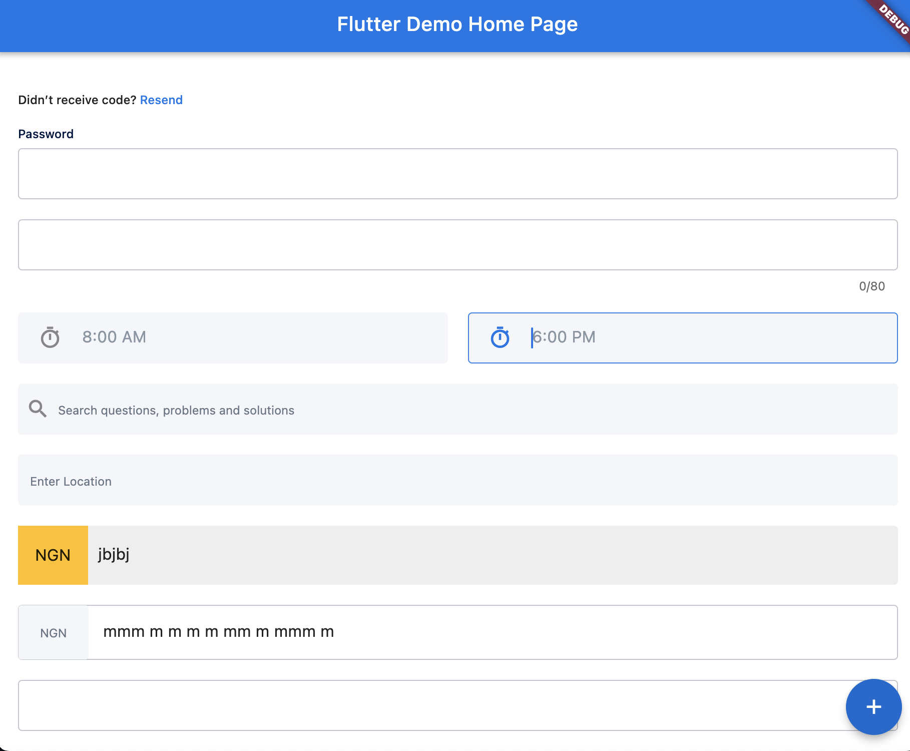
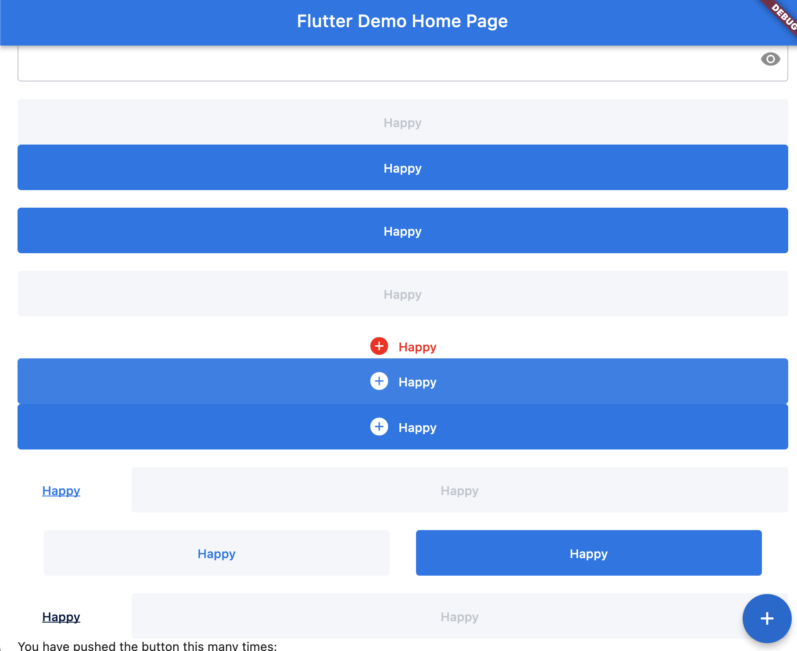

<!--
This README describes the package. If you publish this package to pub.dev,
this README's contents appear on the landing page for your package.

For information about how to write a good package README, see the guide for
[writing package pages](https://dart.dev/guides/libraries/writing-package-pages).

For general information about developing packages, see the Dart guide for
[creating packages](https://dart.dev/guides/libraries/create-library-packages)
and the Flutter guide for
[developing packages and plugins](https://flutter.dev/developing-packages).
-->

<!-- ## Usage

TODO: Include short and useful examples for package users. Add longer examples
to `/example` folder.

```dart
const like = 'sample';
``` -->
# Dwellings Utills

This contains all the common widgets and functions that would be shared
across both dwellings app.

## Getting started

add this to your pubspec.yaml

```yaml

design_system:
    git:
      url: https://github.com/Dwellings-Org/dwellings-utils

```

## Color Reference

Available App colors

| Color             | Hex                                                                |
| ----------------- | ------------------------------------------------------------------ |
| Primary |  #1A73E8 |
| Grey |  #5B6575 |
| Red |  #FF0000 |

AppColor holds all this values as static variable.

use case

```dart

AppColor.primary

AppText.button(
    "Continue",
    color: AppColor.grey,
);
```

## Features

> **Gap**

this is used to add spaces inbetween widgets, it's been customize for easy of use compare to ```sizedbox()```

```dart

// default 
Gap(height:20,width:30);

// when height and withd are the same 
Gap.both(30);

// empty space
Gap.shrink();

// constants [the number afet the s indicate the space]
Gap.s4 
Gap.s6 
Gap.s8 
Gap.s10
Gap.s12;
```

use case

```dart
Column(
    children:[
         Text(
            widget.title!,
            style: widget.titleStyle ??
                AppTextStyle.h6.copyWith(
                  color: AppColor.grey.shade700,
                ),
          ),
          Gap.s8,
          AppText.h1("Showing"),
    ]
)

```

> **Text**

TextStyle and Text where mad to suit the desing use case on the figma board.
this are all the avaialable options
| name             | size             |      Font weight                                             |
| ----------------- | -----------------|------------------------------------------------- |
| h4 | 24 | w500
| h5 | 16 | w500
| h6 | 12 | w500
| body | 16 | w400
| body2 | 12 | w400
| button | 14 | w500
| caption | 10 | w400
| custom | user defined | user defined

Parameters available for this widget

| parameter             | required             |      default      | type                                       |
| ----------------- | -----------------|----------------------------|--------------------- |
| text | yes | |String
| key | no | |Key
| multiText | no | true | bool
| overflow | no | TextOverflow.ellipsis | TextOverflow
| maxLines | no | | int
| height | no | | double
| centered | no | false | true
| textAlign | no | | TextAlign
| fontSize | no | | int
| fontStyle | no | | FontStyle
| fontWeight | no | | FontWeight
| decoration | no | | TextDecoration
| style | no | | TextStyle

it is important to note that ```style``` is on avaialable for custom.

Example

  `AppTextStyle`

```dart
 Text(
    "Testing",
    style: widget.titleStyle ??
        AppTextStyle.h6.copyWith(
            color: AppColor.grey.shade700,
        ),
    )
```

`AppText`

```dart
///predefined button
AppText.button(text)

/// custom
AppText.custom(
    text,
    fontSize: 20,
    fontWeight: FontWeight.w800
)
```

`TwoText`

> TwoText [this is the rich text for the app]

| parameter             | required             |      default      | type                                       |
| ----------------- | -----------------|----------------------------|--------------------- |
| key | no | |Key
| firstText | yes | |String
| secondText | yes | |String
| firstTextStyle | no | | TextStyle?
| secondTextStyle | no | | TextStyle?
| onFirstTap | no | | VoidCallback?
| onSecondTap | no | | VoidCallback

 ```dart
TwoText(
    firstText: "Didn’t receive code? ",
    secondText: "Resend",
    onFirstTap: () {
        log("hello");
    },
    onSecondTap: () {
        log("hello");
    },
),
 ```

## Screenshots

   
   
